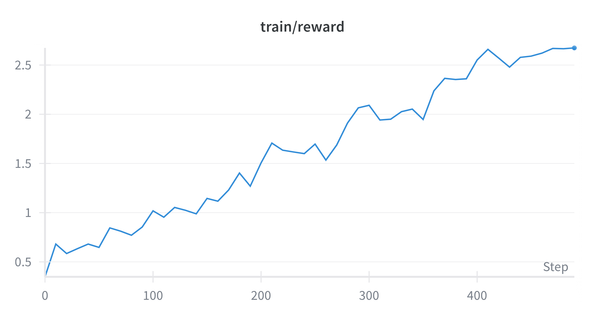
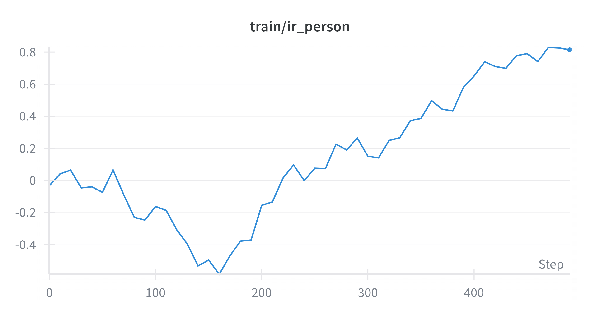
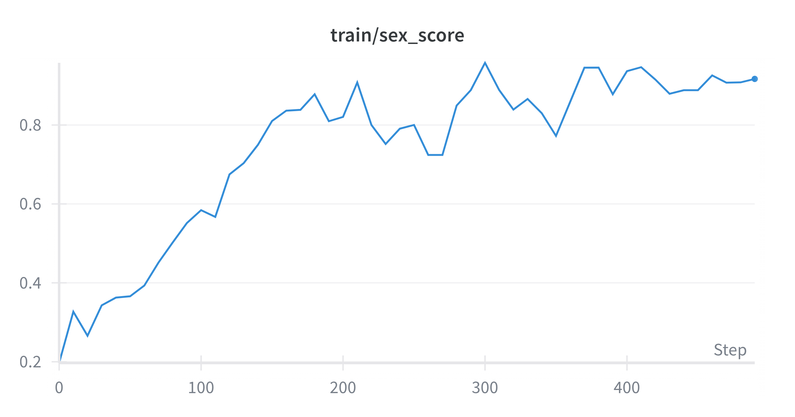

# Policy Gradient Fine-Tuning of Diffusion Models

Diffusion probabilistic models have emerged as a leading framework for generative modeling, achieving state-of-the-art results in image synthesis and enabling advances in video, 3D modeling, biology, and language. However, these models are typically trained with maximum likelihood estimation on large, uncurated datasets. While this ensures fidelity to the data distribution, it often overlooks task-specific objectives such as aesthetic quality, alignment, or fairness.

To address downstream goals, **policy gradient fine-tuning** offers a promising approach. By framing the denoising trajectory as a multi-step decision-making process, this method enables direct optimization of non-differentiable, black-box reward functions. Building on earlier reward-based approaches, policy gradient fine-tuning has shown strong results in areas such as human-preference modeling, prompt–image alignment, and fairness.

---

## Markov Decision Process (MDP) Formulation

The reverse diffusion process can be reframed as a multi-step **Markov Decision Process (MDP)**, with the following components:

- **State**:  
  $s_t = (c, t, x_t)$, where  
  - $c$: context (e.g., prompt or conditioning information)  
  - $t$: current timestep  
  - $x_t$: noisy image at timestep $t$

- **Action**:  
  $a_t = x_{t-1}$, the predicted denoised image at the previous timestep.

- **Policy**:  
  $\pi_\theta(a_t \mid s_t) = p_\theta(x_{t-1} \mid x_t, c)$, the reverse diffusion step parameterized by $\theta$.

- **Transition**:  
  Deterministic transition to the next state:  
  $$P(s_{t+1} \mid s_t, a_t) \equiv (\delta_c,\, \delta_{t-1},\, \delta_{a_t})$$
  where $\delta_c$ denotes copying the context $c$, $\delta_{t-1}$ decrements the timestep, and $\delta_{a_t}$ updates the state with the new latent $a_t$.

- **Reward**:  
  Sparse reward given only at the end of the trajectory:  
  $$R(s_t, a_t) = r(x_0, c)$$ for $$t = 0$$; $$0$$ for $$t > 0$$

  
  where $r(x_0, c)$ is a (possibly non-differentiable) black-box score computed on the final generated sample $x_0$.

- **Initial State**:  
  The process starts from  
  $$P(s_0) = (c, T, \mathcal{N}(0, I))$$
  i.e., the fully noised image $x_T \sim \mathcal{N}(0, I)$.

The reverse diffusion trajectory is denoted as $\tau = (x_T, x_{T-1}, \ldots, x_0)$.

---

## Policy Gradient (REINFORCE)

Maximizing the expected reward in this MDP can be accomplished using the REINFORCE estimator. Employing Monte Carlo sampling, for a batch of $N$ trajectories $\{\tau^{(i)}\}_{i=1}^N$, each conditioned on context $c^{(i)} \sim p(c)$, the gradient is estimated as:

$$
\nabla_\theta J(\theta) \approx
\frac{1}{N} \sum_{i=1}^N r\big(x_0^{(i)}, c^{(i)}\big)
\sum_{t=1}^{T} \nabla_\theta \log p_\theta\big(x_{t-1}^{(i)} \mid x_t^{(i)}, c^{(i)}\big)
$$

This approach requires sampling multiple full trajectories, each involving several inference steps on the diffusion model. As a result, training is computationally intensive, since it requires looping over all timesteps for each image.

---

## Pretrained Model

We use the publicly available diffusion model [`google/ddpm-celebahq-256`](https://huggingface.co/google/ddpm-celebahq-256) as the policy initialization for fine-tuning. This model was trained on the **CelebA-HQ dataset**, a high-resolution subset of the CelebA dataset containing 30,000 facial images at $1024 \times 1024$ resolution. CelebA-HQ preserves the attribute richness of the original CelebA dataset—such as age, gender, and hairstyle—while enhancing image quality. CelebA itself contains over 200,000 celebrity images with diverse identities, poses, lighting, and backgrounds, making it a widely adopted benchmark for generative modeling of faces.

Although CelebA-HQ provides images at $1024 \times 1024$, the model was trained on downsampled versions at $256 \times 256$, which is also the resolution used in our experiments. The model follows the **DDPM framework** and uses a **U-Net** architecture trained to predict the noise component $\epsilon$ added during the forward diffusion process.

**Empirical observation:**  
When sampling unconditionally, the majority of generated images—approximately **78%**—depict women. This reflects imbalances in the underlying CelebA-HQ dataset and highlights the importance of addressing such biases in downstream applications.

---

## Scheduler

We employ a **Denoising Diffusion Implicit Model (DDIM) scheduler** for the reverse sampling process during training and inference. The number of inference steps is fixed at $T = 50$. The variance schedule is linear and remains unchanged during fine-tuning.

---

## Reward Functions

As a case study, we apply our method to counteract the demographic bias exhibited by the pretrained diffusion model—specifically, its tendency to generate a disproportionate number of female faces. Our goal is to guide the model toward producing more male-presenting images, without compromising realism or overall image quality.

To achieve this, we define a **composite reward function** that integrates multiple perceptual and attribute-based signals. For a batch of final generated images $x_0$, we compute:

- **ImageReward (IR):**  
  A reward model trained to reflect human aesthetic preferences. Since this model expects a text prompt as input, we use:  
  > "a natural, high-quality portrait photograph of a person with realistic facial features, normal hair color, natural expression, and clean background."

- **Gender Reward:**  
  This binary reward component mitigates demographic bias and encourages the generation of male-presenting images. It uses an external pre-trained image classification pipeline to predict the probability of an image being male:
    - If the predicted male probability is $\geq 0.8$ or $\leq 0.2$ (high confidence), that probability is used as the score.
    - Otherwise, the score is set to $0.0$ (ambiguous or low-confidence predictions).
    - The continuous score is then binarized: images with a male probability $\geq 0.8$ receive a reward of $1$, otherwise $0$.

The **total reward** used for optimization is:

$$
r(x_0) = \mathrm{IR}(x_0) + 2 \cdot \mathrm{GenderReward}(x_0)
$$

---

## Hardware Setup and Parallelism

All experiments were conducted on a single machine equipped with four NVIDIA T4 GPUs. **Parallelism is critical for this project** due to the computational intensity of policy gradient fine-tuning, which requires:

1. **Multiple trajectory sampling** for each training step
2. **Full diffusion inference** (50 timesteps) for reward computation  
3. **Gradient accumulation** across all timesteps in the reverse process
4. **Batch processing** of images through external reward models

### Multi-GPU Distributed Training Architecture

We implement **Distributed Data Parallel (DDP)** training using **Hugging Face's Accelerate library**, which provides automatic multi-GPU coordination and gradient synchronization. The parallelization strategy operates across **two distinct phases** of each training epoch:

**Phase 1: Parallel Trajectory Generation** - At the beginning of each epoch, all GPUs simultaneously generate diffusion trajectories and compute rewards  
**Phase 2: Parallel Policy Training** - GPUs then train on the collected trajectories using distributed gradient computation

The parallelization strategy operates at multiple levels:

#### 1. **Batch Distribution Across GPUs**
```python
# Dynamic batch allocation per GPU
num_batches_per_gpu = math.ceil(samples_per_epoch / (local_batch_size * num_processes))
```
- Input batches are automatically distributed across all available GPUs
- Each GPU processes its subset independently, maximizing hardware utilization
- Supports flexible batch sizing with `--local_batch_size` parameter

#### 2. **Phase 1: Parallel Trajectory Generation** 
At the start of each epoch, all GPUs work in parallel to:
- Generate diffusion trajectories from random noise to final images (50 timesteps each)
- Evaluate generated images using reward models (ImageReward, gender classifier)
- Store trajectories with their corresponding rewards for training

#### 3. **Phase 2: Parallel Policy Training**
After trajectory collection, GPUs simultaneously train on the data:
- Compute log-probabilities for stored trajectory timesteps
- Calculate policy gradients using REINFORCE with collected rewards
- Perform distributed backpropagation across all 50 timesteps

#### 4. **Distributed Gradient Computation**
```python
# Gradient accumulation across timesteps and GPUs
for t in range(inference_timesteps):
    with accelerator.accumulate(model):
        loss = -reward * log_probs[t]
        accelerator.backward(loss)
```
- Gradients are accumulated across all 50 timesteps of the reverse diffusion process
- Automatic synchronization ensures consistent model updates across GPUs
- Memory-efficient implementation with strategic cache clearing

#### 5. **Cross-GPU Communication and Aggregation**
- **Reward gathering**: `accelerator.gather(rewards)` collects results from all GPUs for global normalization
- **Global advantage computation**: Rewards from all GPUs are synchronized to compute consistent global mean/std statistics, ensuring each GPU normalizes advantages using the same global parameters: `advantages = (rewards - global_mean) / global_std`
- **Metric synchronization**: Performance metrics are aggregated for logging
- **Model parameter synchronization**: Ensures consistency across distributed replicas

#### 6. **Memory Optimization Strategies**
- **Mixed GPU/CPU processing**: Intermediate results offloaded to CPU when needed
- **Explicit memory management**: `torch.cuda.empty_cache()` prevents OOM errors  
- **Non-blocking transfers**: Overlapped computation and communication

### Scalability and Performance Impact

The parallelization is essential because policy gradient fine-tuning is inherently compute-intensive: each training step requires generating complete diffusion trajectories, evaluating multiple reward functions, and backpropagating through the entire reverse process. Without multi-GPU support, training would be prohibitively slow for practical applications.

### Running Multi-GPU Scripts

**Training (Policy Gradient Fine-tuning):**
```bash
# Multi-GPU training with 4 GPUs
accelerate launch --num_processes 4 scripts/main.py \
    --local_batch_size 5 \
    --samples_per_epoch 200 \
    --learning_rate 1e-5 \
    --num_epochs 10
```

**Inference (Parallel Image Generation):**
```bash
# Multi-GPU image generation with 4 GPUs - parallelism speeds up batch processing
accelerate launch --num_processes 4 utils/generate_images.py \
    --model_dir final_model_20250615_135803 \
    --batch_size 8 \
    --num_images 100 \
    --num_inference_steps 50
```

Both scripts utilize the specified number of GPUs through Accelerate's distributed framework, with parallelism applied to trajectory generation, reward computation, and gradient updates in training, and to batch processing and image generation in inference.

---

## Results

To evaluate the practical effects of fine-tuning on model behavior, we measured the proportion of male-presenting images generated throughout training using a fixed classification threshold (as described in the Reward Functions section). The results demonstrate the evolution of this ratio across training iterations for different sampling strategies. All runs begin with approximately 20 to 30% male-presenting samples, reflecting the gender imbalance inherent to the pretrained model.

### Training Metrics Evolution

The fine-tuning process reveals interesting dynamics across the three reward components:

- **Gender Score**: Initially increases rapidly as the model learns to prioritize male-presenting features, then stabilizes at higher levels
- **Image Reward**: Initially decreases as the model focuses on gender alignment, but subsequently recovers and increases significantly, demonstrating quality improvement
- **Total Reward**: Shows monotonic ascent throughout training, validating the effectiveness of the composite reward optimization

These three metrics collectively validate that the policy gradient approach successfully steers the model toward the desired objective (gender balance) while preserving generation quality.

<p align="center">
  
  
  
</p>

*Figure: Evolution of training metrics during policy gradient fine-tuning. Left: Total reward shows monotonic increase. Center: Image reward initially decreases then recovers significantly. Right: Gender score rapidly increases then starts to stabilize at higher levels.*

### Visual Sample Evolution

We track the evolution of generated samples from a fixed random seed across training steps. By holding the seed constant, both the initial noise and the sequence of stochastic sampling decisions remain fixed across checkpoints, ensuring that differences in outputs reflect only the effect of model updates.

The progression shows a clear transformation:
- **Early training**: Samples reflect the pretrained model's bias toward female-presenting individuals
- **Mid training**: Gradual shift in gender distribution begins to emerge
- **Late training**: Consistent generation of male-presenting individuals with enhanced visual quality

This visual evolution demonstrates the effectiveness of reward-aligned fine-tuning in steering diffusion model behavior toward desired objectives while maintaining generation fidelity.

<p align="center">
  
</p>

*Figure: Evolution of generated samples from a fixed random seed across training steps. The GIF illustrates the model's progression from the pretrained bias toward female-presenting individuals to a balanced gender distribution as fine-tuning proceeds. Visual quality is maintained or improved throughout.*


---
